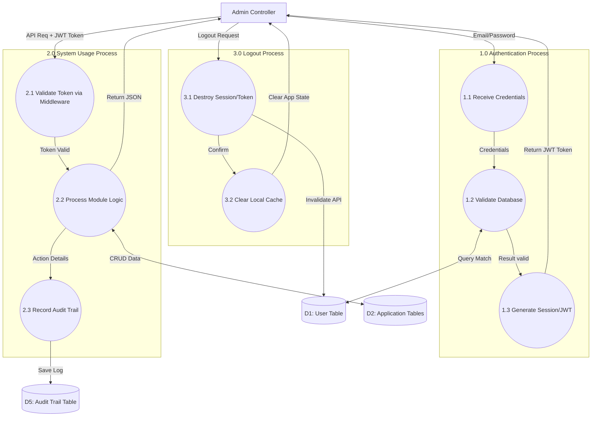

# วิเคราะห์ระบบ CMS TimesNow 2024 & API TimesNow 2024

_(สำหรับเป็นแนวทางประกอบการทำปริญญานิพนธ์)_

เอกสารฉบับนี้ทำการวิเคราะห์การทำงานของระบบ (System Analysis) จาก Source Code ของโปรเจคทั้งฝั่ง Frontend (CMS) และ Backend (API) เพื่ออธิบาย Business Logic ผ่าน Data Flow Diagram (DFD)

---

## 1. วิเคราะห์ Flow หลักระบบ (Main Flow: Login → Usage → Logout)

ภาพรวมของระบบถูกออกแบบด้วยสถาปัตยกรรม Client-Server (React Frontend + Node.js/Express Backend) ผ่าน RESTful API

### 🔑 1.1 กระบวนการเข้าสู่ระบบ (Login Flow)

1. **Submit Credentials:** ผู้ใช้ (Admin/HR) กรอก Email/Username และ Password ที่หน้า `LoginPage.jsx`
2. **Authenticate:** CMS ส่ง HTTP POST ไปที่ API `/v1/auth/login`
3. **Verify:** Backend ตรวจสอบข้อมูลกับฐานข้อมูล (ตาราง `users` หรือ `employees`) ตรวจสอบรหัสผ่านที่ถูก Hashed
4. **Token Generation:** หากถูกต้อง ระบบสร้าง JWT (JSON Web Token) และส่งกลับไปให้ Frontend
5. **State Management:** `useAuth.js` ในส่วนของ Frontend จะทำการเก็บ Token ลงใน LocalStorage/Context และเปลี่ยนสถานะการเข้าสู่ระบบ
6. **Fetch Permissions:** CMS ขอข้อมูลสิทธิการใช้งาน (Modules) ก่อนพาผู้ใช้เข้าสู่หน้า Dashboard

### 💻 1.2 กระบวนการใช้งาน (Usage Flow - System Operations)

1. **Dashboard Overview:** ผู้ใช้งานเข้าสู่ `DashboardPage.jsx` ระบบดึงข้อมูลสรุปรายวัน ผ่าน `/v1/dashboard/*`
2. **Module Access:** ผู้ใช้งานเปิดเมนูต่างๆ เช่น พนักงาน (Employees), กะการทำงาน (Shifts/Rosters), บันทึกเวลา (Time Records) และการอนุมัติคำขอ (Requests)
3. **API Communication:** ทุกๆ Request ประกอบด้วย HTTP Header `Authorization: Bearer <Token>`
4. **Validation & Execute:** Backend Middleware (`auth.middleware.js` และ `validate.middleware.js`) ดักจับ Request ตรวจสอบ Token ว่ายังไม่หมดอายุและมีสิทธิ ก่อนส่งให้ Controller -> Service ทำการ Query จาก MySQL
5. **Audit Trail:** ทุกๆ Transaction ที่มีการเพิ่ม/แก้ไข/ลบ จะถูกบันทึกประวัติการกระทำลงในฐานข้อมูลผ่าน `audit.record.js` มอดูล (ตาราง `audit_trails`) เพื่อใช้ตรวจสอบย้อนหลัง

### 🚪 1.3 กระบวนการออกจากระบบ (Logout Flow)

1. **Trigger Logout:** ผู้ใช้กดปุ่ม "ออกจากระบบ"
2. **Clear Client State:** CMS เรียกฟังก์ชัน Logout ทำการล้าง JWT Token และ User Data ออกจาก LocalStorage/Context
3. **Server Revocation (Optional):** CMS ยิง API `/v1/auth/logout` เพื่อให้ฝั่ง Server ทำการล้าง Session หรือเคลียร์ Cache (ถ้ามี)
4. **Redirect:** นำผู้ใช้กลับสู่หน้า `LoginPage.jsx`

---

## 2. DFD Level 1: System Process Overview (อ้างอิงตามโครงสร้างฐานข้อมูล)

แผนภาพวิเคราะห์กระแสข้อมูลระดับ 1 (DFD Level 1) สะท้อนให้เห็น Process หลักของระบบแยกตาม Domain และการเข้าถึง Data Store ที่สอดคล้องกับโครงสร้างตารางในฐานข้อมูลหลัก (`time-now-new.sql`)

```mermaid
graph TD
    %% 1. External Entities (ผู้กระทำภายนอก)
    E_Admin[Admin / HR User]
    E_Emp[Employee / Staff]
    E_Device[Biometric Devices]
    E_Leavehub[Leavehub API]

    %% 2. Processes (กระบวนการหลัก)
    P1((1.0 จัดการข้อมูลหลัก<br/>Core Data Mgt.))
    P2((2.0 จัดการตารางทำงาน<br/>Schedule & Rosters Mgt.))
    P3((3.0 ประมวลผลเวลาเข้าออก<br/>Attendance Processing))
    P4((4.0 จัดการคำร้อง<br/>Request Management))
    P5((5.0 จัดการความปลอดภัย<br/>Auth & Audit Logs))
    P6((6.0 เชื่อมต่อภายนอก<br/>Devices & Integrations))

    %% 3. Data Stores (ที่เก็บข้อมูลตามกลุ่ม Tables)
    D1[(D1: Core DB<br/>emp, dept, users)]
    D2[(D2: Shifts DB<br/>shifts, dayoff, rosters)]
    D3[(D3: Attendance DB<br/>logs, daily_summaries)]
    D4[(D4: Requests DB<br/>requests, ot_slots)]
    D5[(D5: Audit & Auth DB<br/>audit_trail, tokens)]
    D6[(D6: Config DB<br/>devices, integrations)]

    %% === Data Flows ===

    %% Admin Interactions
    E_Admin -->|เพิ่ม/ลด พนักงาน, แผนก| P1
    E_Admin -->|ตั้งค่ากะงานและจัดตาราง| P2
    E_Admin -->|ดูรายงานสรุปเวลา| P3
    E_Admin -->|อนุมัติ/ปฏิเสธคำร้อง| P4
    E_Admin -->|ตั้งค่าเครื่องสแกน| P6
    E_Admin -->|Login/Logout| P5

    %% Employee Interactions
    E_Emp -->|ยื่นคำร้อง (OT, สลับกะ, แก้เวลา)| P4
    E_Emp -->|เข้าสู่ระบบ LIFF| P5

    %% Device & Integrations Interactions
    E_Device -->|ส่งข้อมูลลงเวลา (Log)| P6
    P6 -->|ส่งบันทึกเวลา| P3
    E_Leavehub -->|ดึงข้อมูลวันหยุด/วันลา| P6
    P6 -->|อัปเดตตารางเวลา (Rosters)| P2

    %% Database Interactions
    %% P1
    P1 <-->|ดึง/ปรับปรุงข้อมูลโครงสร้างบริษัท| D1

    %% P2
    P2 <-->|จัดการ Assignment และกะรายวัน| D2
    P2 -.->|ตรวจสอบข้อมูลพนักงานพ้นสภาพ| D1

    %% P3
    P3 <-->|บันทึก Log และคำนวณ Daily Summary| D3
    P3 -.->|เปรียบเทียบจากตารางการทำงาน| D2

    %% P4
    P4 <-->|เขียน/อ่าน สถานะคำร้องแบบรวม| D4
    P4 -->|สั่งสร้าง/ปรับปรุงเวลาหรือกะงาน (เมื่อผ่าน)| P3

    %% P5
    P5 <-->|สร้างและทำลาย Refresh Tokens| D5
    P5 -.->|ตรวจสอบสิทธิ์การเข้าถึง (Role)| D1

    %% P6
    P6 <-->|อ่านตั้งค่า Access Control ต่างๆ| D6

    %% Logging flows (ทุก Process ยิง Log ไปหา P5)
    P1 -.->|ส่งบันทึก Activity| P5
    P2 -.->|ส่งบันทึก Activity| P5
    P3 -.->|ส่งบันทึก Activity| P5
    P4 -.->|ส่งบันทึก Activity| P5
```

### คำอธิบาย Process หลักใน DFD Level 1

การออกแบบอ้างอิงตามกลุ่มตารางแบบแยกส่วนความรับผิดชอบ (Separation of Concerns):

- **1.0 จัดการข้อมูลหลัก (Core Data Management):** ครอบคลุมการทำงานกับตารางกลุ่มโครงสร้างบริษัท (`companies`, `departments`, `employees`, `users`) มีหน้าที่เป็น Master Data ให้ Data Store อื่นอ้างอิง
- **2.0 จัดการตารางทำงาน (Schedule & Rosters Management):** จัดการระเบียบเวลาทำงานของพนักงาน อิงจากตารางหมวด Shifts, Dayoff และการ Generate ตารางรายบุคคลลง `rosters`
- **3.0 ประมวลผลเวลาเข้าออก (Attendance Processing):** จุดศูนย์กลางการคำนวณเวลาการทำงาน โดยรับข้อมูลเวลาดิบ (`attendance_logs`) มาประมวลผลเทียบกับตารางเวลาเกิดเป็นผลลัพธ์ลงในตาราง `attendance_daily_summaries`
- **4.0 จัดการคำร้อง (Request Management):** รองรับระบบคำร้องทุกประเภทในตารางเดียว (`requests` และ `roster_ot_slots`) จากผู้ใช้งาน (เช่น พนักงานยื่นผ่านระบบ LIFF) เพื่อส่งต่อไปยัง HR สำหรับอนุมัติ
- **5.0 จัดการความปลอดภัย (Auth & Audit Logs):** ทำหน้าที่ออกและตรวจสอบ `refresh_tokens` รวมถึงดักจับความเคลื่อนไหวของระบบทั้งหมดเพื่อบันทึกลง `audit_trail`
- **6.0 เชื่อมต่ออุปกรณ์และระบบภายนอก (Devices & Integrations):** ควบคุมการตั้งค่าเครื่องจุดสแกนหน้า (`devices`, `device_access_controls`) และการ Sync วันหยุดจากระบบ Leavehub (`company_integrations`)

---

## 3. DFD Level 2: Login → Usage → Logout Process

แผนภาพ DFD Level 2 เจาะลึกตามขั้นตอนระบบในข้อ 1 แสดงทิศทางข้อมูลตั้งแต่เข้าจนจบ



### คำอธิบาย DFD Level 2 (ตาม Flow Login -> Usage -> Logout)

1. **Authentication Process (Login):**
   - รับข้อมูลรหัสผ่านเข้ามา (1.1) ส่งไปเปรียบเทียบในฐานข้อมูลส่วนของ Users (1.2)
   - ถ้ารหัสถูกต้อง จะทำการสร้าง Token (1.3) และส่งคืนเพื่อให้ Admin นำไปเป็น "กุญแจ" สำรองไว้ตลอดการใช้งาน
2. **System Usage Process (การใช้งานหน้าต่างๆ):**
   - ทุกๆ การใช้งาน (เพิ่ม ขอดู ลบ แก้ไข ข้อมูล) ข้อมูลที่ส่งมาต้องมี Token ซึ่งจะถูกชำแหละและตรวจสอบโดย Middleware (2.1)
   - หาก Token ผ่าน จะทะลุเข้าสู่ Logic กลาง (2.2) เพื่อเชื่อมต่อกับ Database ระบบ
   - ข้อมูลการทำคำสั่งที่สำคัญ เช่น อนุมัติการเข้างาน หรือเพิ่มกะ จะถูกบันทึกลงระบบประวัติใช้งาน (Audit Trails) ผ่าน Process (2.3) ทันที
3. **Logout Process:**
   - เมื่อยิงคำสั่ง Logout จากระบบ (3.1) ระบบหลังบ้านจะบันทึกสถานะสิ้นสุดและปฏิเสธ Token นั้น (ถ้ามี Blacklist Implementation)
   - ลบคุกกี้และตัวแปรทิ้งจากแอปพลิเคชันฝั่งเครื่องผู้ใช้งาน (3.2) เพื่อคืนหน้าบ้านเข้าสู่หน้าต่าง Login รูปแบบเดิม

---

## 4. สรุปกระบวนการทำงานหลัก (Core Process Summary)

ระบบ CMS และ API ของ TimesNow ถูกออกแบบมาเพื่อจัดการระบบเวลาการทำงานอย่างครบวงจร ซึ่งสามารถสรุปเป็นกระบวนการหลักตามโครงสร้าง Data Flow Diagram (ลักษณะเดียวกับแนวทางของรุ่นพี่) ได้ดังนี้:

1. **เข้าสู่ระบบ (Login/Authentication):** ควบคุมการเข้าถึงระบบโดยใช้ Email/Password และออกสิทธิ์การเข้าใช้งานผ่านระบบ Token
2. **จัดการข้อมูลองค์กร (Core Data Mgt.):** ผู้ดูแลระบบเพิ่ม/แก้ไขข้อมูลแผนกและประวัติพนักงาน
3. **จัดการอุปกรณ์ (Device Mgt.):** ควบคุมเครื่องสแกนใบหน้าและกำหนดสิทธิ์เข้าใช้ประตูเข้า-ออกของพนักงาน
4. **จัดการตารางการทำงาน (Shift & Roster Mgt.):** สร้างรูปแบบกะการทำงาน (Shift), วันหยุด (Dayoff) และคำนวณตารางงานรายบุคคล (Roster) สมบูรณ์
5. **จัดการวันหยุดจากภายนอก (Leavehub Sync):** จัดการสิทธิและโควต้าวันลาพนักงานผ่านการเชื่อมต่อ API ของ Leavehub
6. **จัดการคำร้อง (Request Mgt.):** พนักงานยื่นและผู้ดูแลระบบอนุมัติคำร้องต่างๆ เช่น ขออนุมัติทำ OT (Overtime) แก้ไขเวลาเข้าสแกน และเปลี่ยนกะ
7. **ประมวลผลเวลาเข้าออก (Attendance Processing):** ดึงข้อมูลการลงเวลาดิบจากเครื่องสแกน มาเปรียบเทียบกับตารางทำงานเพื่อสรุปสถานะรายวัน (มาสาย/ขาด/ลา)
8. **บันทึกประวัติการกระทำ (Audit Log):** ระบบบันทึกอัตโนมัติถึงทุกการเพิ่มข้อมูลหรือลบเพื่อตรวจสอบย้อนหลัง
9. **จัดทำรายงาน (Report & Dashboard):** สรุปยอดข้อมูลทางสถิติของพนักงาน, เวลาทำงาน, และวันหยุด เพื่อให้ HR นำเสนอเป็นรายงานข้อมูลดิบไปยังฝั่งเงินเดือน
